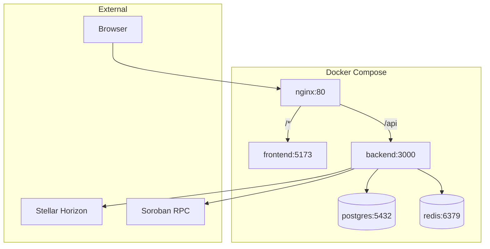

# Infrastructure Documentation

> Docker, scripts, and deployment configuration

---

## Docker Configuration

### Files Overview

| File | Size | Purpose |
|------|------|---------|
| `docker-compose.yml` | 4.4KB | Base services (Postgres, Redis) |
| `docker-compose.dev.yml` | 1.6KB | Development overrides |
| `docker-compose.prod.yml` | 6.8KB | Production config |
| `Dockerfile` | 0.6KB | Backend image |

### Service Architecture



### Base Services (`docker-compose.yml`)

```yaml
services:
  postgres:
    image: postgres:15
    ports: ["5432:5432"]
    volumes: ["postgres_data:/var/lib/postgresql/data"]
    
  redis:
    image: redis:7
    ports: ["6379:6379"]
```

### Development (`docker-compose.dev.yml`)

- Hot reload for backend
- Mounted source volumes
- Debug logging

**Commands:**
```bash
# Start development
docker compose -f docker-compose.yml -f docker-compose.dev.yml up

# Rebuild
docker compose -f docker-compose.yml -f docker-compose.dev.yml up --build
```

### Production (`docker-compose.prod.yml`)

- Nginx reverse proxy
- Built frontend assets
- Health checks
- Restart policies
- Volume persistence

---

## Root Scripts

| Script | Purpose |
|--------|---------|
| [[scripts/setup.js]] | Initial environment setup (12KB) |
| [[scripts/init.sh]] | Docker initialization (3KB) |
| [[scripts/reset_dev_db.sh]] | Reset development database (2KB) |
| [[scripts/bootstrap-admins.js]] | Create initial admin users (3KB) |
| [[scripts/test-email.js]] | Test SMTP configuration (3KB) |

### [[scripts/setup.js]] ⭐
> **Environment setup wizard**

Functions:
- Validates environment variables
- Creates Stellar accounts (testnet)
- Funds accounts via Friendbot
- Deploys smart wallet factory
- Outputs configuration

### [[scripts/init.sh]]
> **Docker initialization**

Steps:
1. Wait for Postgres
2. Run Prisma migrations
3. Bootstrap admin users
4. Start backend

---

## Environment Files

| File | Purpose |
|------|---------|
| `.env` | Active environment |
| `.env.example` | Template with all vars |
| `.env` | Base dev config (multisig mode, auto-read by Compose) |
| `.env.production` | Production values |
| `.env.production.template` | Production template |

See [[overview/env_variables]] for complete reference.

---

## CI/CD

> **Path**: `.github/`

GitHub Actions workflows for:
- Running tests
- Linting
- Building images

---

## Key Commands

### Development

```bash
# Start all services
docker compose up -d

# View logs
docker compose logs -f backend

# Run migrations
docker compose exec backend npm run prisma:migrate

# Reset database
./scripts/reset_dev_db.sh
```

### Production

```bash
# Build and start
docker compose -f docker-compose.prod.yml up -d --build

# View logs
docker compose -f docker-compose.prod.yml logs -f

# Database backup
docker compose exec postgres pg_dump -U postgres stellar_tokens > backup.sql
```

---

## Related

- [[overview/env_variables]] — Env vars
- [[backend/_INDEX]] — Backend
- [[frontend/_INDEX]] — Frontend
